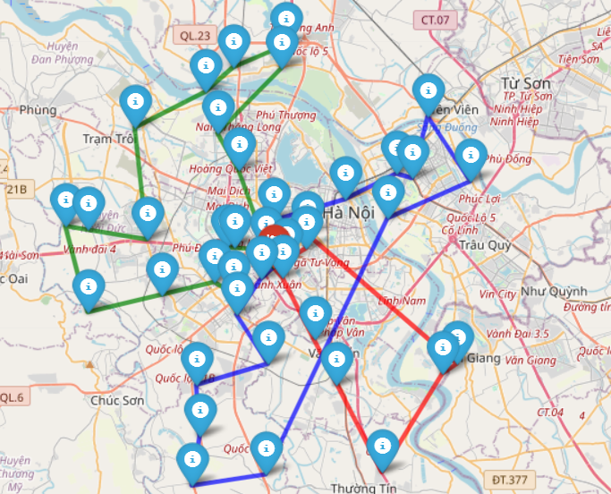

# Vehicle Routing Problem (VRP) using Genetic Algorithm

This project provides a complete solution for the Vehicle Routing Problem (VRP) using a Genetic Algorithm (GA) approach, including data generation, optimization, and visualization.

## Problem Overview

The Vehicle Routing Problem (VRP) is a classic combinatorial optimization problem where a fleet of vehicles must deliver goods to a set of locations (customers) from a central depot. The objective is to minimize the total distance traveled by all vehicles, ensuring each location is visited exactly once and each vehicle route starts and ends at the depot.

## Genetic Algorithm Summary

A Genetic Algorithm (GA) is a population-based metaheuristic inspired by natural selection. In this project, GA is used to evolve a population of candidate solutions (chromosomes) to find near-optimal routes for the VRP. The main steps include:
- **Initialization**: Generate a population of random solutions.
- **Selection**: Choose parent solutions using binary tournament selection.
- **Crossover**: Combine parents using two-point crossover to create offspring.
- **Mutation**: Apply swap mutation to introduce diversity.
- **Elitism**: Preserve the best solutions across generations.
- **Evaluation**: Use a fitness function (total distance) to guide evolution.

## Libraries Used
- `geopy`: Geocoding and geodesic distance calculations
- `folium`: Interactive map visualization
- `matplotlib`: Plotting fitness evolution
- `numpy`, `random`: Numerical operations and randomization
- `csv`, `os`: Data I/O and file management

## Project Structure & Main Classes

- **GetData**: Generates random locations around a depot, computes the distance matrix, and creates interactive maps with markers for depot and locations.
- **Chromosome**: Represents a candidate VRP solution as a permutation of locations and route delimiters. Decodes routes and computes total distance (fitness).
- **Population**: Manages a collection of chromosomes, initializes the population, and provides methods to find the best solution and compute statistics.
- **Genetic**: Implements the genetic algorithm, including selection, crossover, mutation, elitism, and the main evolution loop.
- **main.py**: Orchestrates the workflow: data generation, population initialization, running the GA, and visualizing results.

## How to Run

1. **Install dependencies** (if needed):
   - `pip install geopy folium matplotlib numpy`
2. **Run the main script:**
   ```bash
   python src/main.py
   ```
3. **Outputs:**
   - Interactive HTML maps of the initial and final solutions in `src/static/`
   - Fitness evolution plot (`fitness_evolution.png`)
   - Distance matrix CSV file

## Cloning the Project

To get started, clone the project from GitHub:

```bash
git clone https://github.com/MH2425/Genetic-Algorithm-For-VRP.git
cd Genetic-Algorithm-For-VRP
```

## Visual Results

- **initial_map.png**: Visualization of all generated locations (blue markers) and the depot (red marker) on the map.

  

- **initial_solution.png**: The best solution found in the initial population (first generation). Each route is shown with a different color connecting the depot and locations.

  

- **final_solution.png**: The best solution after 1000 generations of evolution. Routes are optimized and visualized with distinct colors for each vehicle.

  

These images are automatically generated in the `src/static/` directory after running the program. They demonstrate the improvement of the genetic algorithm from random initial solutions to an optimized set of routes.

## Output Example
- **Initial and Final Solution Maps**: Visualize depot, locations, and vehicle routes with different colors.
- **Fitness Evolution Plot**: Shows how the best and average solution improves over generations.
- **Console Output**: Displays initial and final best solutions, total distance, and improvement percentage.

## Parameters
- **Location parameters**: Depot address, number of locations, max distance from depot, number of vehicles
- **GA parameters**: Population size, number of generations, mutation rate, elitism size

## Notes
- The number of routes in the final solution may be less than the number of vehicles if the GA finds it optimal to use fewer vehicles.
- The project is modular and can be extended for more complex VRP constraints.

## Authors
- Cao Nguyen Minh Hoang - MH2425

---
This project demonstrates the power of genetic algorithms for solving real-world routing and logistics problems, with interactive visualization and clear modular code.

